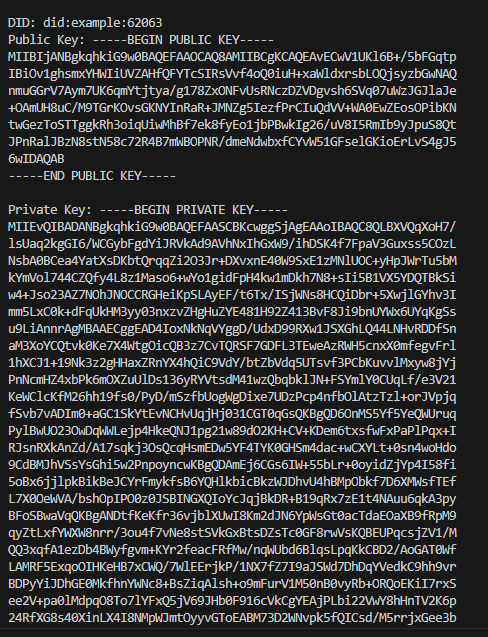

# Decentralized Identifiers (dids) with using "crypto" library

`npm start`

### This script uses the built-in crypto module to generate an RSA key pair and constructs a simple DID document.

**RSA key is a private key based on RSA algorithm.**

